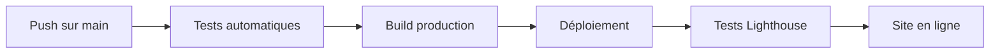

# Guide de Déploiement

## 🚀 Déploiement sur GitHub Pages

### Configuration initiale

1. **Activer GitHub Pages**
   - Aller dans Settings > Pages
   - Source: "GitHub Actions"
   - Le workflow `.github/workflows/deploy.yml` est automatiquement détecté

2. **Configurer les secrets (optionnel)**
   ```
   Settings > Secrets and variables > Actions
   - GA_ID: Votre ID Google Analytics
   ```

3. **Domaine personnalisé (optionnel)**
   - Ajouter votre domaine dans `CNAME`
   - Configurer les DNS chez votre registrar

### Processus de déploiement



## 🔧 Autres plateformes

### Vercel

```bash
# Installation
npm i -g vercel

# Déploiement
vercel --prod
```

### Netlify

```bash
# Build command
npm run build

# Publish directory
./out
```

## 📊 Monitoring post-déploiement

### Vérifications automatiques

- ✅ Performance Lighthouse > 90%
- ✅ Accessibilité > 95%
- ✅ SEO > 95%
- ✅ PWA > 80%

### Actions en cas d'échec

1. **Performance dégradée**
   - Vérifier les images non optimisées
   - Analyser le bundle avec `npm run analyze`
   
2. **Accessibilité**
   - Tester avec un lecteur d'écran
   - Vérifier les contrastes
   
3. **SEO**
   - Valider les meta tags
   - Tester avec Google Search Console

## 🔄 Rollback

En cas de problème :

```bash
# Revenir à la version précédente
git revert HEAD
git push origin main
```

## 📈 Métriques de succès

- Temps de chargement < 3s
- Score Lighthouse moyen > 90%
- Zéro erreur d'accessibilité
- 100% des pages indexées par Google


Pour déployer votre portfolio, voici les étapes détaillées :

## 🚀 Déploiement sur GitHub Pages (Recommandé - Gratuit)

### 1. Préparer le repository GitHub

````bash
# Initialiser Git si pas encore fait
git init

# Ajouter tous les fichiers
git add .

# Premier commit
git commit -m "Initial commit - Portfolio complet"

# Créer un repository sur GitHub (nom: portfolio)
# Puis connecter le repository local
git remote add origin https://github.com/VOTRE-USERNAME/portfolio.git

# Push du code
git branch -M main
git push -u origin main
````

### 2. Configurer GitHub Pages

1. **Aller sur GitHub** → Votre repository → **Settings**
2. **Pages** (dans le menu de gauche)
3. **Source** : Sélectionner "**GitHub Actions**"
4. Le workflow sera automatiquement détecté

### 3. Personnaliser la configuration

### [deploy.yml](file:///home/elbramos/Desktop/personal_projects/portfolio/.github/workflows/deploy.yml)

Créer le fichier de déploiement automatique.

````yaml
name: Deploy Portfolio to GitHub Pages

on:
  push:
    branches: [ main ]
  workflow_dispatch:

permissions:
  contents: read
  pages: write
  id-token: write

concurrency:
  group: "pages"
  cancel-in-progress: false

jobs:
  build:
    runs-on: ubuntu-latest
    steps:
      - name: Checkout
        uses: actions/checkout@v4
        
      - name: Setup Node.js
        uses: actions/setup-node@v4
        with:
          node-version: '18'
          cache: 'npm'
          
      - name: Install dependencies
        run: npm ci
        
      - name: Build project
        run: npm run build
        env:
          NODE_ENV: production
          
      - name: Setup Pages
        uses: actions/configure-pages@v4
        
      - name: Upload artifact
        uses: actions/upload-pages-artifact@v3
        with:
          path: ./out
          
  deploy:
    environment:
      name: github-pages
      url: ${{ steps.deployment.outputs.page_url }}
    runs-on: ubuntu-latest
    needs: build
    steps:
      - name: Deploy to GitHub Pages
        id: deployment
        uses: actions/deploy-pages@v4
````

### 4. Configurer Next.js pour GitHub Pages

### [next.config.js](file:///home/elbramos/Desktop/personal_projects/portfolio/next.config.js)

````javascript
````javascript
````javascript
````javascript
/** @type {import('next').NextConfig} */
const isProd = process.env.NODE_ENV === 'production'
const repoName = 'portfolio' // Nom de votre repository

const nextConfig = {
  output: 'export',
  trailingSlash: true,
  images: {
    unoptimized: true
  },
  
  // Configuration pour GitHub Pages
  assetPrefix: isProd ? `/${repoName}` : '',
  basePath: isProd ? `/${repoName}` : '',
}

module.exports = nextConfig
````

### 5. Ajouter le fichier .nojekyll

````bash
````bash
````bash
# Créer le fichier .nojekyll dans public/
echo "" > public/.nojekyll
````

### 6. Déployer

````bash
````bash
````bash
````bash
# Commit des modifications
git add .
git commit -m "Configure GitHub Pages deployment"
git push origin main

# Le déploiement se lance automatiquement !
# Votre site sera accessible sur : https://VOTRE-USERNAME.github.io/portfolio
````

## 🌐 Alternatives de déploiement

### **Vercel (Recommandé pour performance)**

````bash
# Installer Vercel CLI
npm i -g vercel

# Se connecter
vercel login

# Déployer
vercel --prod

# URL automatique fournie + domaine personnalisé possible
````

### **Netlify**

1. **Drag & Drop** : Glisser le dossier `out` sur netlify.com
2. **Git Integration** : Connecter le repository GitHub
3. **Build settings** :
   - Build command: `npm run build`
   - Publish directory: `out`

## 🔧 Configuration du domaine personnalisé (Optionnel)

### Pour GitHub Pages :

1. **Acheter un domaine** (ex: votre-nom.dev)
2. **Configurer les DNS** chez votre registrar :
   ```
   Type: CNAME
   Name: www
   Value: votre-username.github.io
   
   Type: A
   Name: @
   Values: 185.199.108.153
           185.199.109.153
           185.199.110.153
           185.199.111.153
   ```
3. **Ajouter le fichier CNAME** :
   ````bash
   # filepath: Instructions domaine personnalisé
   echo "votre-domaine.com" > public/CNAME
   git add public/CNAME
   git commit -m "Add custom domain"
   git push
   ````

## 📊 Vérification du déploiement

Une fois déployé, vérifiez :

- ✅ **Site accessible** : https://votre-username.github.io/portfolio
- ✅ **Responsive** : Tester sur mobile/tablette
- ✅ **Performance** : Lighthouse score > 90%
- ✅ **PWA** : Bouton d'installation visible
- ✅ **SEO** : Meta tags présents dans le source

## 🚨 Résolution de problèmes courants

**404 sur GitHub Pages :**
```bash
# Vérifier que le fichier .nojekyll existe
ls public/.nojekyll

# Vérifier la configuration Next.js
cat next.config.js
```

**Styles manquants :**
```bash
# Vérifier les chemins d'assets dans la console navigateur
# Ajuster assetPrefix/basePath si nécessaire
```

**Build qui échoue :**
```bash
# Tester en local
npm run build

# Vérifier les erreurs TypeScript
npm run type-check
```

Suivez ces étapes et votre portfolio sera en ligne sous 5 minutes ! 🎉

Made changes.